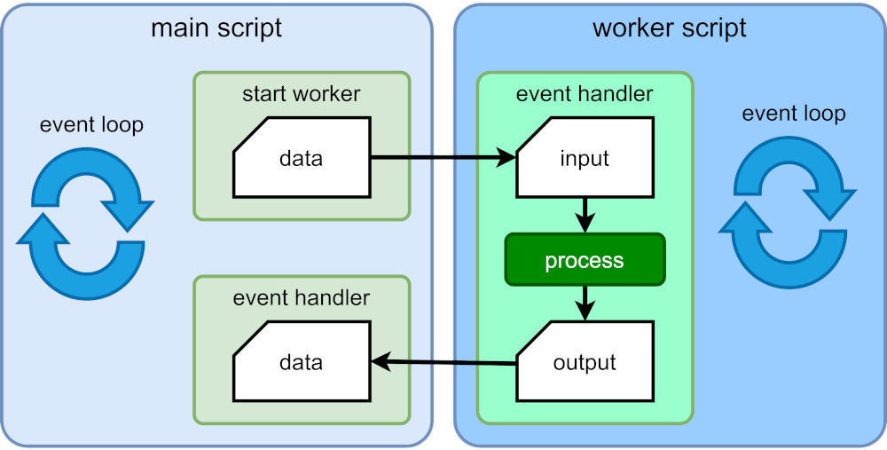

# 🚀 Web Worker Demo

> Web Workers permitem executar scripts em threads em segundo plano, melhorando a performance e responsividade das aplicações web.



## 📋 Sumário

- [Sobre](#sobre)
- [Funcionalidades](#funcionalidades)
- [Como Usar](#como-usar)
- [Exemplo de Código](#exemplo-de-código)
- [Links Úteis](#links-úteis)

## 📖 Sobre

<a id="sobre"></a>

Web Workers são mecanismos que permitem que uma operação de um dado script seja executada em uma thread diferente da thread principal da aplicação Web (`Main thread`). Isso evita o bloqueio da interface do usuário durante cálculos pesados, proporcionando uma experiência mais fluida.

### 🎯 Benefícios

- ✅ **Performance**: Processamento em paralelo
- ✅ **Responsividade**: Interface não bloqueia
- ✅ **Escalabilidade**: Melhor uso de recursos do sistema

## ✨ Funcionalidades

<a id="funcionalidades"></a>

- 🔍 **Busca em Arquivos CSV**: Processamento assíncrono de grandes arquivos
- 📊 **Progresso Visual**: Barra de progresso em tempo real
- 🧵 **Thread Separada**: Uso de Web Workers para cálculos pesados
- 📱 **Interface Responsiva**: Design adaptável a diferentes dispositivos

## 🚀 Como Usar

<a id="como-usar"></a>

1. **Clone o repositório**:
   ```bash
   git clone https://github.com/evandropsantos/web-worker.git
   cd web-worker
   ```

2. **Abra no navegador**:
   - Abra o arquivo `index.html` em um navegador moderno
   - Selecione um arquivo CSV
   - Digite a descrição para busca
   - Clique em "Pesquisar"

3. **Alternativas**:
   - Ative/desative o uso de Web Workers com o checkbox
   - Compare a performance entre Main Thread e Worker Thread

## 💻 Exemplo de Código

<a id="exemplo-de-código"></a>

### Main Thread (index.js)
```javascript
// Criação do worker
const worker = new Worker('worker.js');

// Recebe mensagens do worker
worker.onmessage = function(event) {
    console.log('Mensagem do worker:', event.data);
};

// Envia mensagem para o worker
worker.postMessage('Olá, Worker!');
```

### Worker Thread (worker.js)

```javascript
// Recebe mensagens da main thread
onmessage = function(event) {
    console.log('Mensagem do main thread:', event.data);

    // Processamento pesado aqui
    const result = heavyComputation(event.data);

    // Envia resultado de volta
    postMessage(result);
};
```

## 🔗 Links Úteis

<a id="links-úteis"></a>

- 📚 [Documentação MDN - Web Workers](https://developer.mozilla.org/pt-BR/docs/Web/API/Web_Workers_API)
- 🛠️ [Como usar Web Workers](https://blog.openreplay.com/how-to-use-client-and-server-side-web-workers/)
- 🎨 [Exemplos Práticos](https://developer.mozilla.org/pt-BR/docs/Web/API/Web_Workers_API/Using_web_workers)
- 📺 [Erick Wendel Academy](https://www.youtube.com/@ErickWendelAcademy) - Tutoriais sobre Web Workers
- 📥 [Baixar CSV](https://www.kaggle.com/datasets/foenix/slc-crime/data)

---

<div align="center">

[](LICENSE)

</div>
